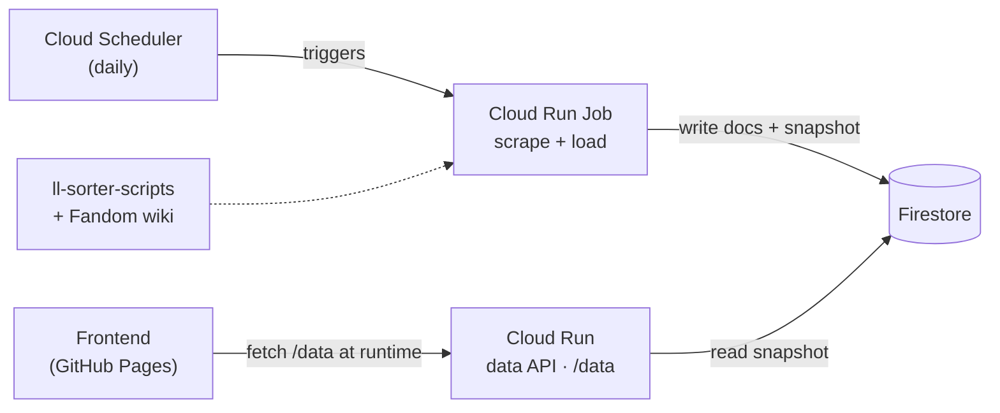

# LL Music Reactions

A web app for creating Love Live music reaction meme videos. Match songs from the Love Live discography with reaction video clips, arrange them on a timeline, and export a stitched MP4 with album art overlays.

## Features

- **Song Search** — Fuzzy search across 871 songs with romaji/hiragana/English support
- **Series Filters** — Filter by franchise (μ's, Aqours, Nijigaku, Liella, etc.), artist, or year
- **Clip Library** — Pre-bundled reaction clips searchable by name and emotion tags
- **Drag-and-Drop Timeline** — Arrange clip+song pairs in sequence
- **Setlist Loader** — Load concert setlists (720 performances) as templates
- **Video Preview** — Play through your sequence with album art corner overlay
- **Cloud FFmpeg Export** — Video stitching runs on a Cloud Run service (ffmpeg in a container). Discord-optimized (<25MB MP4)

## Tech Stack

- React 19 + TypeScript
- Vite 6
- Tailwind CSS 4
- @dnd-kit (drag-and-drop)
- Bun + ffmpeg on Cloud Run (server-side video encoding)
- wanakana (Japanese text conversion)

## Getting Started

```bash
bun install
bun dev
```

Add reaction clips to `public/clips/` and thumbnails to `public/thumbnails/`, matching filenames in `src/data/clips-manifest.json`.

## Export Service (Cloud Run)

Video stitching is handled by `server/export.ts` (Bun + ffmpeg), deployed to Google Cloud Run. Reaction clips are bundled into the container image; album art and song audio are fetched at request time.

```bash
# Run the export server locally (used when VITE_EXPORT_API is unset)
bun run server        # listens on http://localhost:3001

# Unit tests for the ffmpeg argument builder
bun test server/

# Deploy / redeploy to Cloud Run (builds via Cloud Build, no local Docker needed)
gcloud run deploy ll-export --source . --region us-central1 \
  --allow-unauthenticated --memory 1Gi --timeout 300 --port 8080
```

The frontend targets the export service via `VITE_EXPORT_API`:

- **Development** (`bun dev`) — unset, falls back to `http://localhost:3001`
- **Production** (`bun run build`) — read from `.env.production` (the Cloud Run URL)

Endpoints:

- `POST /export` — streams **Server-Sent Events** with real progress while it
  works (`start` → `asset` per entry → `ffmpeg_start` → `ffmpeg_progress` →
  `done`), delivering the finished MP4 as base64 in the final `done` event.
  Errors arrive as an `error` event. Running the work inside the streamed
  request keeps Cloud Run's CPU allocated and avoids any shared job state.
- `GET /health` — readiness check.

## Data

Song discography data originates from the Love Live data scrapers
([hamzaabamboo/ll-sorter-scripts](https://github.com/hamzaabamboo/ll-sorter-scripts),
consumed by [hamproductions/the-sorter](https://github.com/hamproductions/the-sorter)).

The app no longer hardcodes or bundles this data. A **Firestore** database is
refreshed **daily** by a Cloud Run Job running those same scrapers, and the
frontend fetches it entirely at runtime from `VITE_DATA_URL` (today the Cloud Run
data API's `/data`; the planned cutover serves a static `dataset.json` from
Firebase Hosting's global CDN — same shape, just an env change). There is no
bundled fallback: if the data URL is unreachable the app shows an error (with
retry) rather than stale data. Firestore stores each entity as a queryable
document and is ~$0/month at this scale.



See [`pipeline/README.md`](pipeline/README.md) for the full architecture and the
**data model (ER) diagram**.

## Contributing

This project uses [Conventional Commits](https://www.conventionalcommits.org/en/v1.0.0/) for commit messages.

Format: `<type>[optional scope]: <description>`

Examples:
```
feat: add year filter to song picker
fix: prevent timeline reorder crash on single entry
docs: update README with export instructions
refactor: extract album art resolver into utility
```

Common types: `feat`, `fix`, `docs`, `style`, `refactor`, `test`, `chore`, `build`.
