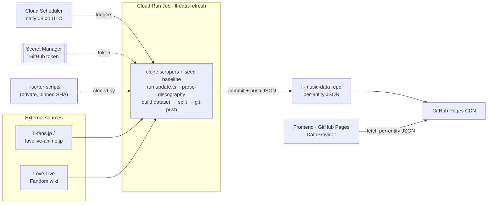
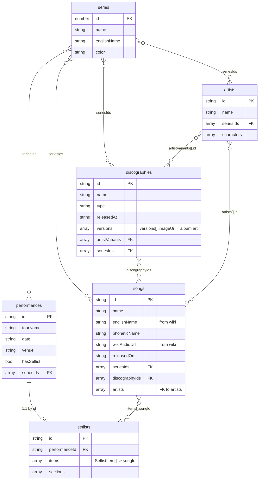

# Data pipeline (GCP)

A daily **Cloud Run job** scrapes the Love Live catalog (using the same scraper
scripts as [`hamzaabamboo/ll-sorter-scripts`](https://github.com/hamzaabamboo/ll-sorter-scripts)),
builds the dataset, and **publishes it as per-entity JSON to the
[`ll-music-data`](https://github.com/mting314/ll-music-data) repo**, which GitHub
Pages serves to the frontend. **No database, no API** — the job is the single
producer; the data repo (served by Pages) is the single source the app reads.

## Architecture



The frontend fetches **per-entity JSON files** from `VITE_DATA_BASE` at runtime
(`https://<user>.github.io/ll-music-data/<file>.json`). There is no bundled
fallback: data is never embedded in the app, and an unreachable (or
unconfigured) base surfaces an error rather than stale data.

## Data model

The job emits one JSON file per entity (`songs.json`, `artists.json`, …) plus
`seriesNames.json` and `build.json`. Relationships:



Published files: `songs.json`, `artists.json`, `discographies.json`,
`seriesInfo.json`, `seriesNames.json` (JP→EN name map), `performances.json`,
`setlists.json` (keyed by `performanceId`), and `build.json`
(`{ generatedAt, counts }`). The frontend assembles these into one `Dataset`.

> `characters` (id, name, school, units, seriesIds) is also scraped, but not yet
> consumed by the app.

## Pieces

| Path | What |
|------|------|
| `build-dataset.ts` | Assemble the scraped data into one canonical dataset object |
| `publish-data.ts` | Split the dataset into per-entity files + `git push` to the data repo |
| `run-refresh.ts` | Daily job: clone+run scrapers → build → publish |
| `Dockerfile` | Cloud Run Job image (Bun + git) |
| `setup-gcp.sh` | One-time provisioning (secret, job, scheduler) |

## ⚠️ Tokens

`ll-sorter-scripts` is **private**, so the Cloud Run Job needs a **GitHub PAT**
to clone it — and the *same* token also needs **write** access to the
`ll-music-data` repo to push the published JSON. `setup-gcp.sh` stores it in
Secret Manager; the job reads it as `GITHUB_TOKEN` (redacted from all logs). The
public `hamproductions/the-sorter` seed repo needs no token.

## Setup (run once, after review)

```bash
export GITHUB_TOKEN='<PAT: read on ll-sorter-scripts, write on ll-music-data>'
./pipeline/setup-gcp.sh     # secret + job + scheduler, runs the job once
# frontend already reads it via .env.production:
#   VITE_DATA_BASE=https://<user>.github.io/ll-music-data
```

## ⚠️ Validation note

Dataset assembly + the publish split are covered by tests. The **scrape step**
hits external sites and depends on the upstream repos' layout, so it's validated
only in the live Cloud Run Job.
