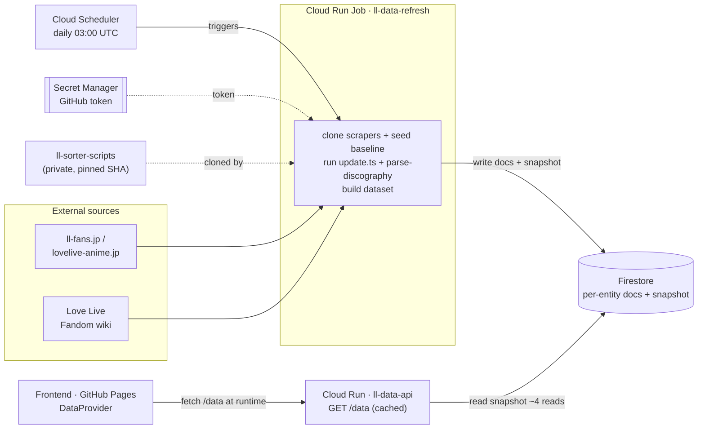
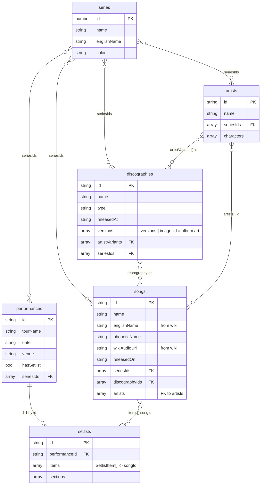

# Data pipeline (GCP)

Replaces the hardcoded `src/data/*.json` imports with a **Firestore** database
that is **refreshed daily** using the same scraper scripts as
[`hamzaabamboo/ll-sorter-scripts`](https://github.com/hamzaabamboo/ll-sorter-scripts).

Firestore stores each entity as a **native document** (queryable per-record),
and is ~$0/month at this scale (free tier). A Cloud Run **data API** reads it
server-side and serves the dataset to the frontend (so the browser never needs
the Firebase SDK).

## Architecture



The frontend fetches `GET /data` from `VITE_DATA_API` at runtime. There is no
bundled fallback: data is never embedded in the app, and an unreachable (or
unconfigured) API surfaces an error rather than stale data.

## Data model

Firestore collections (each entity is one native document, keyed by its `id`):



Plus two non-entity collections:

- **`meta`** — `meta/seriesNames` (JP→EN name map) and `meta/build`
  (`{ generatedAt, counts }` for the last refresh).
- **`snapshot`** — the whole dataset JSON split into `<1 MiB` chunks
  (`snapshot/0…N` + `snapshot/meta`), so `GET /data` is ~4 reads instead of
  ~3,100. The per-entity collections above stay queryable; the snapshot is just
  the cheap serving path.

The `/data` response the frontend consumes is:

```jsonc
{
  "songs": [...], "artists": [...], "discographies": [...],
  "seriesInfo": [...], "seriesNames": { "<jp>": "<en>" },
  "performances": [...], "setlists": { "<performanceId>": { ...Setlist } },
  "build": { "generatedAt": "<iso>", "counts": { "songs": 886, ... } }
}
```

> `characters` (id, name, school, units, seriesIds) is also scraped and stored,
> but not yet consumed by the app.

## Pieces

| Path | What |
|------|------|
| `firestore.ts` | Firestore REST client + JSON↔native-value converter (no SDK) |
| `build-dataset.ts` | Assemble canonical JSON → one dataset object |
| `load-firestore.ts` | Write the dataset into Firestore collections (batched) |
| `run-refresh.ts` | Daily job: clone+run scrapers, build dataset, write Firestore |
| `Dockerfile` | Cloud Run Job image (Bun + git) |
| `../data-api/server.ts` | Cloud Run service: reads Firestore, serves `GET /data` |
| `setup-gcp.sh` | One-time provisioning (Firestore, service, job, scheduler) |

## Why per-record documents

Each song/artist/etc. is a real Firestore document (native typed fields, not a
JSON blob), so you can later run server-side queries
(e.g. `where('seriesIds','array-contains', x)`) and add filtered API endpoints
without re-modeling the data. `firestore.test.ts` verifies the encode/decode
round-trips on real entity shapes.

## ⚠️ The scraper repo is private

`ll-sorter-scripts` is **private**, so the Cloud Run Job needs a **GitHub token**
(read access) to clone it. `setup-gcp.sh` stores it in Secret Manager; the job
reads it as `GITHUB_TOKEN` (redacted from all logs). The public
`hamproductions/the-sorter` seed repo needs no token.

## Setup (run once, after review)

```bash
export GITHUB_TOKEN='<PAT with read access to ll-sorter-scripts>'
./pipeline/setup-gcp.sh     # Firestore + secret + service + job + scheduler, runs job once
# then point the frontend at the data API and redeploy Pages:
#   .env.production -> VITE_DATA_API=https://ll-data-api-XXXX.us-central1.run.app
```

## Local development

```bash
cd pipeline && bun install
bun run build:local         # assemble src/data -> ./dataset.json (no network)
bun test ../pipeline        # converter round-trip tests
```

## ⚠️ Validation note

The converter, dataset assembly, data API shape, and frontend wiring are
verified by CI / local tests. The **scrape step** hits external sites and
depends on the upstream repos' layout, so it's validated in the live Cloud Run
Job (the full scrape + wiki pull has been run successfully end-to-end).
